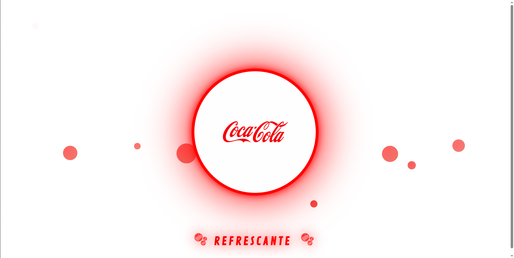
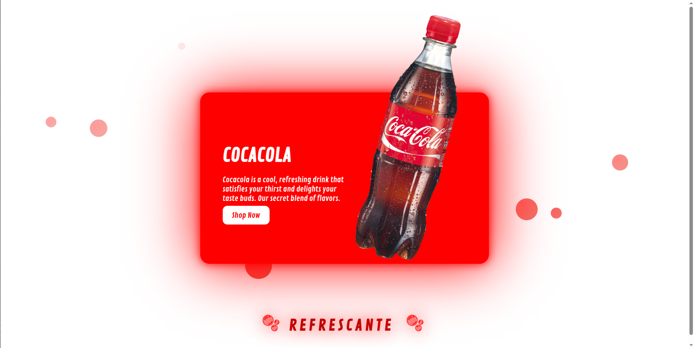

# 🫧 Interactive Coca-Cola Card
Una tarjeta de producto interactiva animada construida con HTML y CSS puro, inspirada en Coca-Cola. Incluye efectos hover, burbujas flotantes y un título animado con gradiente.

📸 Vista previa

Al hacer hover sobre la tarjeta, se expande revelando la imagen del producto, el nombre de la marca y un botón de compra.

## 🚀 Características

Tarjeta interactiva con hover — se expande de 300px a 600px con transiciones suaves
Círculo animado — transiciona de borde rojo a fondo rojo sólido al hacer hover
Imagen del producto — aparece rotada y escalada al activar la tarjeta
Burbujas flotantes — 10 burbujas animadas con distintos tamaños, velocidades y oscilaciones
Título hero animado — entra desde arriba con efecto shimmer y letras con rebote continuo
Tipografía personalizada — fuentes de Google Fonts (Contrail One como principal)
Totalmente en CSS puro — sin JavaScript, sin frameworks

## 📁 Estructura del proyecto
/
├── index.html
├── style.css
└── resources/
    ├── pngwing.com (1).png   # Logo de Coca-Cola
    ├── pngwing.com.png       # Imagen de la lata
    ├── VistaPrevia1.png      # Captura de vista previa
    └── VistaPrevia2.png      # Captura de vista previa
🛠️ Uso

Clona o descarga el repositorio
Asegúrate de tener las imágenes en la carpeta resources/
Abre index.html en tu navegador

No requiere instalación ni dependencias. Funciona directamente en el navegador.

## 🎨 Animaciones CSS utilizadas
AnimaciónDescripciónfloatUpBurbujas que suben desde el fondo con desvanecimientotitleRevealEntrada del título desde arriba con expansión de letrasshimmerEfecto de brillo deslizante sobre el gradiente del títuloletterBounceRebote suave continuo en los emojis del título
## ✏️ Personalización
Para adaptar la tarjeta a otro producto o marca, modifica en index.html:

src de .logo → tu logo
src de .product_img → tu imagen de producto
Texto en <h2> y 
 → nombre y descripción
Enlace en <a href="#"> → URL de tu tienda

Para cambiar el color principal (actualmente rojo #ff0000), busca y reemplaza el valor en style.css.
🧰 Tecnologías

HTML5
CSS3 (variables CSS, keyframes, transitions, gradients)
Google Fonts

📄 Licencia
MIT — libre para usar y modificar.